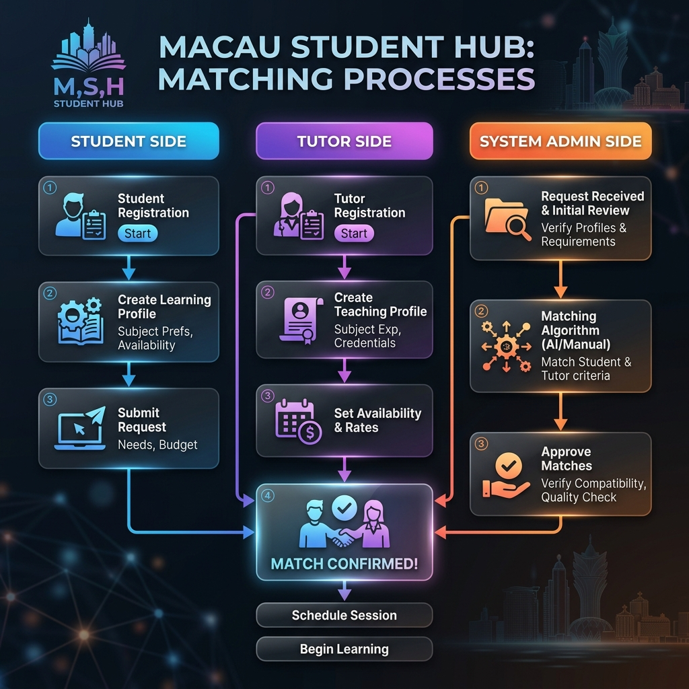
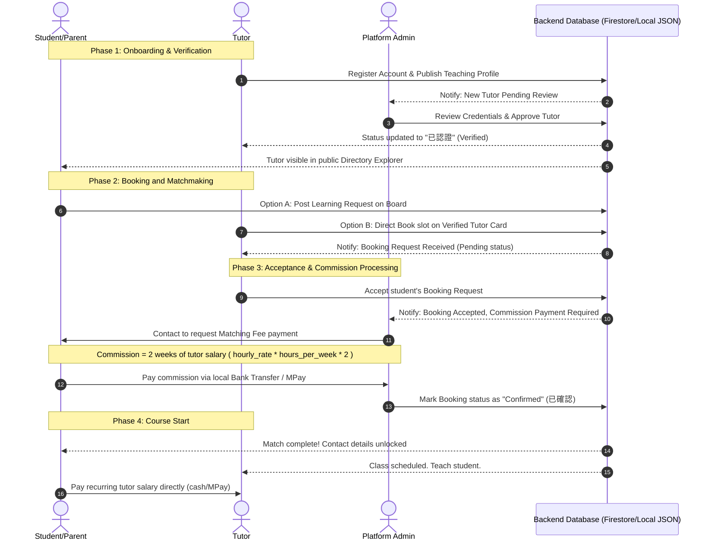

# Macau Student Hub: Business Flow & Transaction Lifecycle

This document describes the operational flow, matching lifecycle, and commercial model of the **澳門學生網 | Macau Student Hub** platform.

---

## 1. Process Lifecycle Diagram

Below is the matching lifecycle diagram showing the interactions between Students, Tutors, and System Administrators.

---

## 2. Dynamic Transaction Sequence

This Mermaid sequence diagram illustrates the user actions, database events, verification steps, and fee processing steps for a successful match:

---

## 3. Detailed Business Flow Steps

### Phase 1: Tutor Vetting & Verification
1. **Registration**: Tutors sign up and submit academic backgrounds, qualifications, Peninsula/Taipa/Coloane region preferences, familiar curricula (IB, IGCSE, Joint Entrance Exam), hourly rate in MOP, and bios.
2. **Pending State**: The profile is initially flag-restricted (`isApproved: false`). Tutors see a pending status banner, and the profile remains invisible to students searching the directory.
3. **Admin Verification**: Admins review qualifications in the control panel and click **「核准」 (Approve)**. The status updates to `✅ 已認證` and the profile becomes publicly discoverable.

### Phase 2: Session Booking or Matching Boards
* **Direct Booking**: Students browse the verified directory, filter by subject/location/curriculum, select an available slot, and submit a booking request.
* **Match Requests**: Alternatively, students post learning requirements (e.g., "Prep for IELTS speaking, Taipa region, Budget 250 MOP/hr") to the public **需求配對板 (Match Board)**, where tutors can review and contact them.

### Phase 3: Commission Charging & Payment Settlement
1. **Commission Model**: The platform charges an **escrow matching fee (commission)** equal to **two weeks of the tutor's teaching salary**.
   * *Formula*: `Commission = tutor_hourly_rate * booking_session_duration * weekly_lessons * 2`
2. **Platform Invoicing**: Once a tutor accepts a booking request, the booking is set to `Pending Payment`. The platform admin coordinates with the parent/student.
3. **Local Payment Collection**: Payment is settled via Macau local bank transfer or MPay. 
4. **Activation**: Once the admin marks the booking as confirmed (`confirmed`) in the portal, the tutor and student details are unlocked.

### Phase 4: Course Delivery & Regular Salary
* **Direct Payments**: Tutors deliver classes according to schedule.
* **Zero Platform Deductions**: The student pays the tutor's salary directly (cash, MPay, or bank transfer) at the end of each session/month. The platform does not touch or deduct any portion of ongoing tutor earnings.
